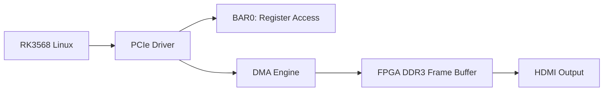

# RK3568 PCIe DMA Driver Implementation Plan

## Goal
Create a Linux kernel driver for RK3568 to communicate with the PG2L50H FPGA via PCIe, enabling DMA transfers of camera frame data for HDMI display.

---

## FPGA Register Map (Analyzed from RTL)

Based on analysis of `ips2l_pcie_dma_controller.v`, the FPGA uses BAR1 for DMA command registers:

| Offset | Register | Description |
|--------|----------|-------------|
| 0x100 | DMA_CMD_REG | Bits[9:0]=length-1, [16]=32/64bit, [24]=R/W |
| 0x110 | DMA_L_ADDR | Lower 32-bit target address |
| 0x120 | DMA_H_ADDR | Upper 32-bit target address (for 64-bit) |

### DMA Command Bits
- `[9:0]` - Transfer length in DWORDs minus 1
- `[16]` - Address mode: 0=32-bit, 1=64-bit
- `[24]` - Direction: 0=Read (MRD), 1=Write (MWR)

### BAR0
Used for CPLD data readback (camera frame buffer data).

---

## Proposed Changes

### [NEW] `pcie_fpga_dma.c` - Linux PCIe Driver

**Location**: `/home/linaro/drivers/pcie_fpga_dma/`

Core driver module with:
1. **PCIe probe/remove** - Device enumeration (VID=0x0755, DID=0x0755)
2. **BAR mapping** - Map BAR0 (64KB) for register access
3. **DMA buffer management** - Coherent DMA allocations
4. **DMA transfer API** - Write commands to initiate transfers
5. **Character device** - `/dev/fpga_dma0` for userspace access

---

### [NEW] `pcie_fpga_dma.h` - Header File

Driver ioctl definitions and structures for userspace interface.

---

### [NEW] `Makefile` - Kernel Module Build

Standard out-of-tree kernel module Makefile.

---

### [NEW] `fpga_dma_test.c` - Userspace Test Application

Simple application to:
1. Open `/dev/fpga_dma0`
2. Allocate DMA buffer
3. Initiate DMA read from FPGA
4. Display received data

---

## Verification Plan

### 1. Module Load Test
```bash
# On RK3568
cd /home/linaro/drivers/pcie_fpga_dma
make
sudo insmod pcie_fpga_dma.ko
dmesg | tail -20
# Expect: "FPGA PCIe DMA driver loaded, BAR0 mapped at xxxxx"
```

### 2. Device Node Test
```bash
ls -la /dev/fpga_dma*
# Expect: /dev/fpga_dma0 character device
```

### 3. Register Read Test
```bash
# Compile and run test app
gcc -o fpga_dma_test fpga_dma_test.c
sudo ./fpga_dma_test
# Expect: Successfully reads FPGA registers
```

### 4. Manual Verification by User
> Please verify on your RK3568 hardware that:
> 1. `dmesg` shows driver loaded without errors
> 2. `/dev/fpga_dma0` is created
> 3. Test app can read/write FPGA registers

---

## Architecture Diagram



---

## Phase 2: V4L2 Video Device (Future)

After basic DMA works:
1. Create V4L2 video capture device
2. Use DMA to transfer camera frames to V4L2 buffers
3. Allow GStreamer/ffmpeg to display via HDMI

---

## Files to Create

| File | Location |
|------|----------|
| pcie_fpga_dma.c | /home/linaro/drivers/pcie_fpga_dma/ |
| pcie_fpga_dma.h | /home/linaro/drivers/pcie_fpga_dma/ |
| Makefile | /home/linaro/drivers/pcie_fpga_dma/ |
| fpga_dma_test.c | /home/linaro/drivers/pcie_fpga_dma/ |

---

## Phase 2: Color Correction (Userspace First)

### Scope
- Keep FPGA and kernel DMA ABI unchanged.
- Fix only userspace PPM decode interpretation.
- Default output mode is now `bgr565` (OV5640 `0x4300=0x60` assumption).

### Behavior
- `frame.raw` remains unchanged.
- `--save-ppm` now decodes as `bgr565` by default.
- `--ppm-mode` can still override:
- `rgb565`
- `bgr565`
- `rgb565-swap`
- `bgr565-swap`
- Test app prints active decode mode before saving PPM.

### Validation
1. Single frame default mode:
```bash
sudo ./fpga_dma_test --read frame.raw --save-ppm frame_default.ppm --verify --dump 64
```
2. Explicit mode comparison:
```bash
sudo ./fpga_dma_test --read frame.raw --save-ppm frame_bgr.ppm --ppm-mode bgr565
sudo ./fpga_dma_test --read frame.raw --save-ppm frame_rgb.ppm --ppm-mode rgb565
```
3. Continuous regression (stability + color):
```bash
sudo ./fpga_dma_test --continuous --count 20 --save-ppm seq_color --ppm-mode bgr565
```

---

## Phase 3: HDMI(KMS) Display Integration (Implemented)

### Scope
- Userspace path: `/dev/fpga_dma0` -> `GStreamer appsrc -> videoconvert -> capsfilter(BGRx) -> kmssink`.
- No kernel ABI change and no FPGA RTL change.
- Fixed 1280x720 RGB565/BGR565 path, target 10 FPS.

### New Files
- `fpga_hdmi_display.c`: DMA-trigger + mmap + copy-ring + appsrc/videoconvert/kmssink render loop.
- `run_hdmi_kms.sh`: environment checks and launch wrapper.

### Build
```bash
make displayapp
```

### Run
```bash
./run_hdmi_kms.sh
```

### Notes
- Default pixel order is `bgr565`.
- Input control supports exit keys `ESC` / `Q`.
- Added copy-ring options: `--copy-buffers` and `--queue-depth`.
- Copy ring solves single-buffer hold deadlock; `videoconvert` handles downstream buffer pool handoff for KMS.
- Added post-convert `capsfilter` to force `BGRx` output and disable `videoconvert` passthrough on 16-bit input.
